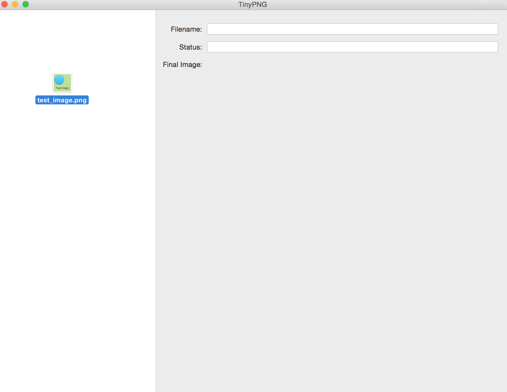
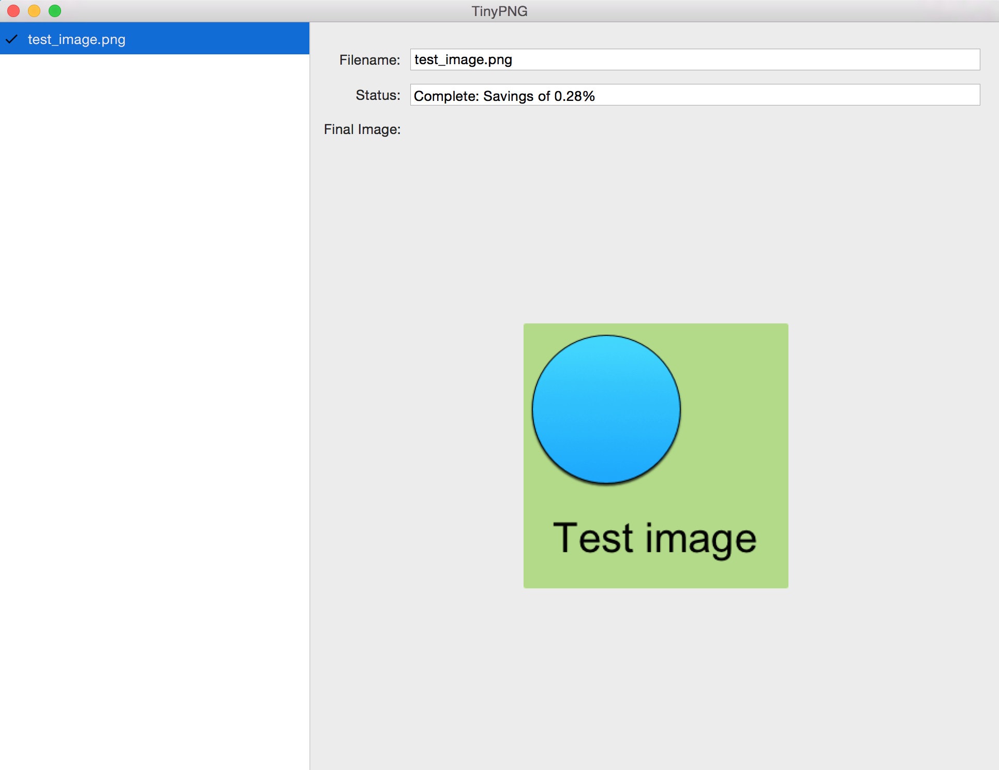

# TinyPNG Mac App
This is a simple [TinyPNG](https://tinypng.com/) app for the Mac. TinyPNG can be used to reduce they size of PNGs. To use this app you will need to get an API key from the [TinyPNG developer](https://tinypng.com/developers) page and put it in the preferences window. Once an API key has been entered you can drag PNG files onto the left list area to process them.

